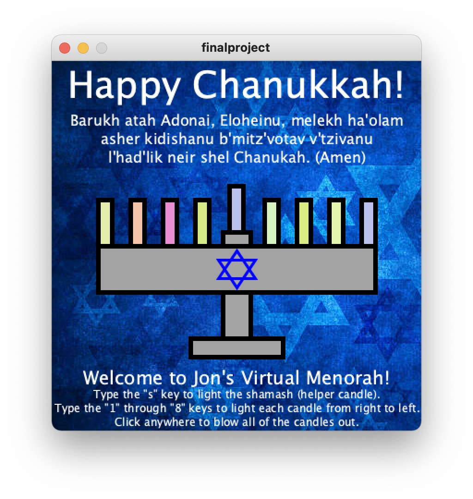

# Menorah Processing Sketch

I wrote this Processing sketch back in 2010 as a final project for ISE 108.

It it a fully functioning menorah that responds to keyboard and mouse input.

Type s to light the shamash and then the numbers 1-8 to light each candle.

Clickng anywhere clears the menorah and randomises the colors.

Type "c" to see the secret credits screen.

Requires Processing 2 to run.
